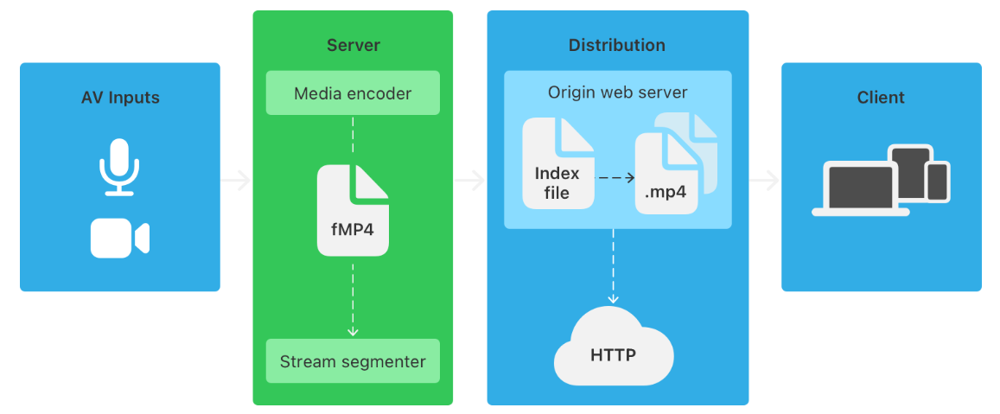

# HLS 스트리밍

### FFMPEG
```text
비디오, 오디오의 En/Decoding, Transcoding 등 멀티미디어 파일 처리를 위한 오픈 소스 프로젝트이자 툴
무료로 제공되며 멀티 플랫폼 환경에서 이용 가능
```

### HLS 구조
```text
2009년 Apple에서 발표한 HTTP 기반 적응 비트레이트 스트리밍 통신 프로토콜
비디오 데이터를 .m3u8 확장자로 된 재생목록을 기록한 파일과 .ts 확장자의 여러 개의 멀티미디어 파일로 분할하여 스트리밍에 이용
```


### 사용법
- FFMPEG 프로그램을 OS에 설치
  https://github.com/BtbN/FFmpeg-Builds/releases
```text
ffmpeg-master-latest-win64-gpl.zip
```
- 환경변수 등록(FFMPEG 실행파일 폴더/bin)
- localhost:8080/convert 로 src/main/resources/convert/good.mp4 파일 인코딩
```text
아래 파일이 src/main/resources/file에 생성됨
good.m3u8 파일 (메타데이터)
good.ts 파일들 (영상을 10초로 나눈 파일)
```
- localhost:8080/index.html 파일 실행 (크롬브라우저)
- network 개발자 도구 켜서 스트리밍되는지 확인

### 참고 문헌
https://developer.apple.com/documentation/http-live-streaming#Encode-and-deliver-streaming-media
https://developer.apple.com/documentation/http-live-streaming#Encode-and-deliver-streaming-media